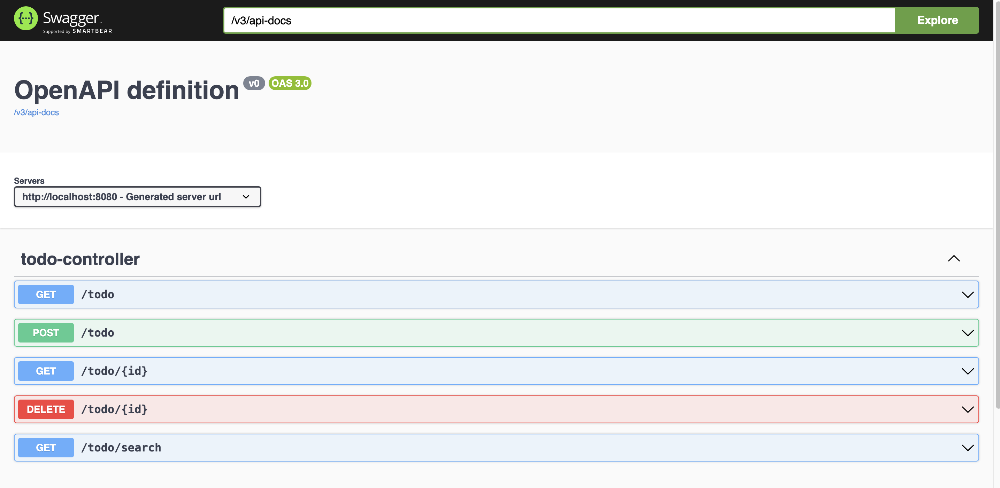
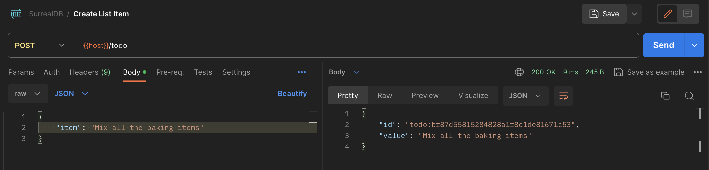
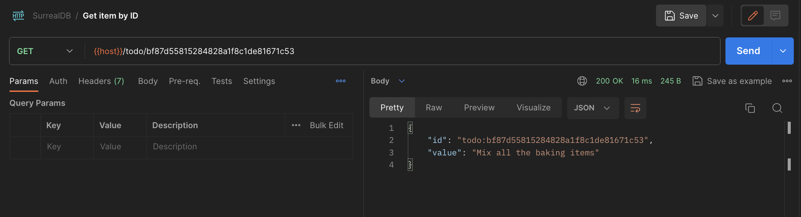
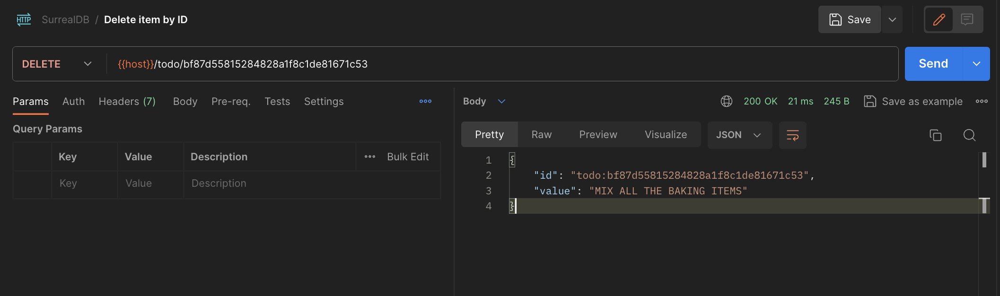
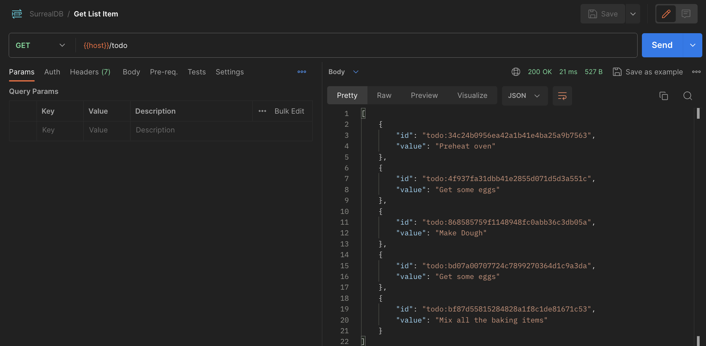

# Starter Kit for SurrealDB + SpringBoot

A starter kit todo app REST API using SpringBoot integrated with Surreal DB.  

## Prerequisites:

- Java 21 and Maven >= 3.8.8
- Docker & Docker compose to start surrealDB if not installed locally.

## Getting Started

1. Clone the Repository:

```bash
git clone https://github.com/PDROJACK/surrealdb-springboot-starter.git
```

2. cd to the backend directory `surrealdb-springboot-starter`.

3. Inside the root of repository directory. Run below command to start SurrealDB:
    
    ```docker compose up```

4. Inside the root of repository directory. Run below command to start SurrealDB:
    
    ```mvn spring-boot:run```

## API Details
1. Postman Collection for the API is present in ```docs/SurrealDB.spring.postman.json```

2. OpenAPI definition can be accessed at this url after starting the app: http://localhost:8080/swagger-ui/index.html#/


3. [POST] Create Item


4. [GET] Get Item by ID


5. [DELETE] Delete Item by ID


6. [GET] Get All Items


## Contributing

This starter kit is done as part of Hacketoberfest 2023 project.If you find any issues or have suggestions for improvements, please feel free to open an issue or create a pull request.

Happy coding!
